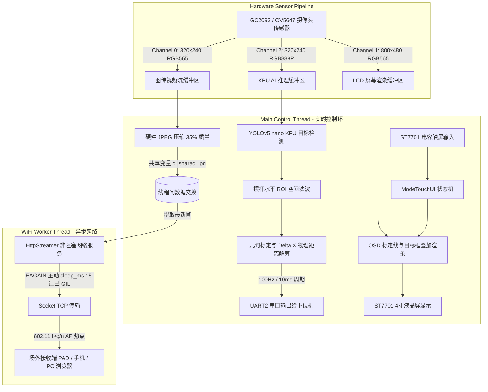

# 2026年全国大学生电子设计竞赛（TI杯）H题
# 车载平衡滚球运动控制系统 —— K230 视觉检测与无线图传子系统

本项目为 **2026 年全国大学生电子设计竞赛（TI 杯）H 题《车载平衡滚球运动控制系统》** 的视觉检测与无线图传主控核心工程，基于 **嘉楠科技 K230（庐山派 / CanMV-K230）** 异构双核 RISC-V + KPU 硬件平台开发，使用 MicroPython 语言实现。

---

## 目录
- [2026年全国大学生电子设计竞赛（TI杯）H题](#2026年全国大学生电子设计竞赛ti杯h题)
- [车载平衡滚球运动控制系统 —— K230 视觉检测与无线图传子系统](#车载平衡滚球运动控制系统--k230-视觉检测与无线图传子系统)
  - [目录](#目录)
  - [一、 赛题任务与指标对应](#一-赛题任务与指标对应)
  - [二、 系统总体架构设计](#二-系统总体架构设计)
  - [三、 核心模块化详细说明](#三-核心模块化详细说明)
    - [3.1 多通道传感器硬件流水线](#31-多通道传感器硬件流水线)
    - [3.2 KPU 硬件加速 YOLOv5 nano 目标检测与 ROI 空间滤波](#32-kpu-硬件加速-yolov5-nano-目标检测与-roi-空间滤波)
    - [3.3 几何标定与物理空间坐标解算](#33-几何标定与物理空间坐标解算)
    - [3.4 100Hz 高频低时延串口控制链路](#34-100hz-高频低时延串口控制链路)
    - [3.5 独立后台线程与非阻塞 HTTP MJPEG 实时图传](#35-独立后台线程与非阻塞-http-mjpeg-实时图传)
    - [3.6 ST7701 4寸液晶触屏 GUI 与系统状态机](#36-st7701-4寸液晶触屏-gui-与系统状态机)
  - [四、 硬件引脚复用与配置参数速查](#四-硬件引脚复用与配置参数速查)
    - [4.1 FPIOA 引脚分配表](#41-fpioa-引脚分配表)
    - [4.2 核心可调参数表](#42-核心可调参数表)
  - [五、 部署与使用指南](#五-部署与使用指南)
    - [5.1 SD 卡文件目录结构](#51-sd-卡文件目录结构)
    - [5.2 启动与脱机运行流程](#52-启动与脱机运行流程)
  - [六、 关键问题与性能调优总结](#六-关键问题与性能调优总结)

---

## 一、 赛题任务与指标对应

| 赛题要求项目 | 题目核心技术指标 | 本工程解决方案与对应实现 |
| :--- | :--- | :--- |
| **要求 1（图传）** | 摆球位置监测图传，小车端发射，场外接收并实时显示小球在凹槽中滚动画面（6分） | 板载 WiFi AP 热点 (`Keng230_AP`) + HTTP MJPEG 高性能独立推流服务，场外手机/PAD/PC 浏览器秒级接入观看与录屏。 |
| **要求 2（循迹）** | 沿黑线顺时针行驶 1 圈停在 A 点，时间 $\le 20\text{s}$，停车偏差 $\le 2\text{cm}$（16分） | 视觉系统在待机/就绪模式提供极低算力占用，保证供电稳定与低功耗，预留触屏一键启动接口。 |
| **要求 3（静止控制）** | 静止状态小球 $O \to +5\text{cm} \to -5\text{cm}$ 稳定，时间 $\le 5\text{s}$，误差 $\le 1\text{cm}$（13分） | 高精度物理标定（$25.0\text{ pixels/cm}$），实时计算位置偏差 $\Delta X$ 并以 100Hz 频率通过 UART 传输给下位机平衡控制算法。 |
| **要求 4（动态平衡）** | A 启动顺时针通过 B 点，时间 $\le 8\text{s}$，小球稳定在 $O$ 点，误差 $\le 1\text{cm}$（20分） | YOLOv5 nano 硬件加速目标检测（$\ge 25\text{ FPS}$）+ 水平凹槽 ROI 动态抗反光滤波，毫秒级响应小球动态位置。 |
| **要求 5（整圈平衡）** | A 启动顺时针 1 圈通过 A 点，时间 $\le 30\text{s}$，小球稳定在 $O$ 点，误差 $\le 1\text{cm}$（20分） | 解决离心力与加减速扰动下的连续追踪问题，提供高置信度位移反馈。 |
| **要求 6（任意指定位置）**| 钢球置于摆杆任意指定位置，整圈行驶，稳定在指定点附近，误差 $\le 1\text{cm}$（20分） | 全局线性坐标系映射，支持在摆杆任意区间（$-12\text{cm} \sim +12\text{cm}$）实现绝对毫米级位置解算。 |

---

## 二、 系统总体架构设计

为了保证**控制的高实时性（毫秒级无抖动）**与**无线图传的流畅性（15 FPS）**互不干扰，本系统采用**双线程解耦与三路独立硬件视频流水线**架构：



---

## 三、 核心模块化详细说明

### 3.1 多通道传感器硬件流水线
K230 内部集成强大的硬件 ISP 与多通道图像缩放子系统。在 `main.py` 中通过 `Sensor` 配置了三路硬件独立的视频通道：
- **Channel 0 (`CAM_CHN_ID_0`)**：配置为 `320x240 RGB_565`，供 WiFi 图传使用。小分辨率大幅减少 JPEG 编码耗时与网络带宽占用。
- **Channel 1 (`CAM_CHN_ID_1`)**：配置为 `800x480 RGB_565`，直接匹配 ST7701 4寸电容液晶屏的分辨率，用于高清实时取景、OSD 信息显示与触屏交互。
- **Channel 2 (`CAM_CHN_ID_2`)**：配置为 `320x240 RGB_888_PLANAR`，为 KPU 深度学习硬件加速器提供所需的 Planar 格式，免去 CPU 软件格式转换开销。
- **同相抓取机制**：在主循环中连续调用 `g_sensor.snapshot(chn=CAM_CHN_ID_2)` 和 `g_sensor.snapshot(chn=CAM_CHN_ID_1)`，确保 AI 目标检测结果与 LCD 显示画面保持时间轴完全对齐，消除了传统方案中检测框与移动物体不同步的拖影现象。

### 3.2 KPU 硬件加速 YOLOv5 nano 目标检测与 ROI 空间滤波
- **深度学习模型**：采用轻量化定制训练的 **YOLOv5 nano** 模型（`myball_v5n.kmodel`，`v5n` 即 YOLOv5 nano），参数量极小且兼具高精度与超低推理延时，针对钢球在各种光照反光条件下的形态特征进行了充分泛化。
- **摆杆 ROI 空间滤波**：由于赛场复杂环境（车身金属反光、周围赛道黑线、背景杂物），程序在屏幕坐标系定义了感兴趣区域：
  $$\text{ROI} = [X: 1, Y: 196, W: 800, H: 51]$$
  任何落在 ROI 区域之外的候选检测框将被直接滤除，极大地提高了检测的特异性与鲁棒性。

### 3.3 几何标定与物理空间坐标解算
- **物理参考系**：摆杆全长 $25\text{cm}$，中心点定义为原点 $O$（$0\text{cm}$），向右为正（$+5\text{cm}$），向左为负（$-5\text{cm}$）。
- **标定参数**：
  - 摆杆中心在 800x480 屏幕上的像素位置：$X_{\text{origin}} = 371$
  - 空间比例尺：$\text{PIXELS\_PER\_CM} = 25.0\text{ pixels/cm}$（即 $1\text{cm} = 25\text{ 像素}$，分辨率精度可达 $0.4\text{mm/pixel}$）。
- **坐标解算公式**：
  若检测到钢球在 LCD 坐标系下的中心横坐标为 $X_{\text{ball}}$，则其相对于中心点 $O$ 的物理偏差 $\Delta X$（单位：$\text{cm}$）为：
  $$\Delta X = \frac{X_{\text{ball}} - X_{\text{origin}}}{\text{PIXELS\_PER\_CM}} = \frac{X_{\text{ball}} - 371}{25.0}$$

### 3.4 100Hz 高频低时延串口控制链路
- **引脚复用**：`Pin 11` $\to$ `UART2_TXD`，`Pin 12` $\to$ `UART2_RXD`。
- **波特率**：$115200\text{ bps}$，8 位数据位，无校验，1 位停止位。
- **发送节拍**：采用基于系统硬件时钟节拍（`time.ticks_ms()`）的防漂移调度机制，以 $10\text{ms}$ 周期（$100\text{Hz}$）向下位机单片机发送 ASCII 字符串：
  ```
  "{:.2f}\r\n"   # 例如: "0.00\r\n", "4.98\r\n", "-5.02\r\n"
  ```
- 下位机直接使用 `atof()` 或状态机解析即可完成 PID 闭环计算，无需复杂的协议解包开销。

### 3.5 独立后台线程与非阻塞 HTTP MJPEG 实时图传
在 MicroPython 单进程环境下，传统的网络 Socket I/O 操作极易阻塞主线程，导致 AI 推理帧率断崖式下跌，进而导致下位机控制失控。本工程实现了多项关键优化：
1. **多线程并发（`_thread`）**：将 WiFi AP 的客户端监听与 Socket 数据推送剥离至独立的 `wifi_worker_thread`。
2. **非阻塞与 GIL 协作机制**：在 `HttpStreamer._send_nonblocking()` 中，遇到网络缓冲区满（`EAGAIN` / 错误码 11）时，调用 `time.sleep_ms(15)` 主动出让 Python 全局解释器锁（GIL），使主控线程的 AI 视觉检测与 UART 控制可以满速运行。
3. **内置自适应 Web 端**：客户端使用任意浏览器访问 `http://192.168.169.1:6001` 即可打开美观的监控大屏，内置 CSS 动画指示器与断线自动重连 JavaScript 脚本。

### 3.6 ST7701 4寸液晶触屏 GUI 与系统状态机
- **状态机设计**：
  - `STATE_STANDBY`（待机模式）：关闭 YOLO 推理以降低系统功耗与发热，屏幕显示 "Standby Mode" 并保持触控响应。
  - `STATE_MODE1`（运行模式）：全功能开启 YOLO 检测、摆杆刻度线绘制、准星锁定追踪、实时偏差数据屏显及 UART 数据流输出。
- **图形界面（OSD）元素**：
  - 绿色矩形框：摆杆水平 ROI 有效工作区
  - 黄色标定线：中心 $0\text{cm}$ 平衡点
  - 蓝色标定线：$-5\text{cm}$ 与 $+5\text{cm}$ 测试考核关键点
  - 红色圆环 + 青色十字准星：实时锁定钢球几何中心
  - 实时数值显示：当前钢球物理偏移读数 $\Delta X$（如 `X: -0.12 cm`）

---

## 四、 硬件引脚复用与配置参数速查

### 4.1 FPIOA 引脚分配表
| 功能名称 | 庐山派物理引脚 (Pin) | 复用功能定义 (Function) | 连接目标 |
| :--- | :--- | :--- | :--- |
| **UART2 TX** | Pin 11 | `FPIOA.UART2_TXD` | 下位机主控 (STM32/MSPM0) RXD |
| **UART2 RX** | Pin 12 | `FPIOA.UART2_RXD` | 下位机主控 (STM32/MSPM0) TXD |
| **RGB LED R** | Pin 62 | `FPIOA.GPIO62` | 板载红色 LED |
| **RGB LED G** | Pin 20 | `FPIOA.GPIO20` | 板载绿色 LED |
| **RGB LED B** | Pin 63 | `FPIOA.GPIO63` | 板载蓝色 LED |
| **I2C Touch** | I2C 0 接口 | `TOUCH(0)` | ST7701 电容触摸驱动芯片 |

### 4.2 核心可调参数表
| 参数变量名 | 默认值 | 物理意义与调节建议 |
| :--- | :--- | :--- |
| `WIFI_SSID` | `"Keng230_AP"` | 板载 AP 热点 SSID，赛场建议设置易于识别的名字 |
| `WIFI_PWD` | `"51850107"` | AP 密码（至少 8 位） |
| `ORIGIN_X_LCD` | `371` | 摆杆中心 $O$ 点像素坐标，若机械支架微调需在此重新标定 |
| `PIXELS_PER_CM` | `25.0` | 像素/厘米比例尺，取决于摄像头到摆杆的垂直安装高度 |
| `g_conf_thresh` | `0.45` | YOLO 检测置信度阈值（建议 $0.40 \sim 0.55$） |
| `g_nms_thresh` | `0.45` | YOLO NMS 非极大值抑制 IoU 阈值 |
| `UART_SEND_MS` | `10` | 串口发送周期（$10\text{ms} \to 100\text{Hz}$） |

---

## 五、 部署与使用指南

### 5.1 SD 卡文件目录结构
```text
/sdcard/
├── myball_v5n.kmodel     # 钢球 YOLOv5 nano 目标检测模型 (v5n)
├── libs/
│   └── YOLO.py           # YOLO KPU 推理与后处理封装库
└── main.py               # 视觉主控与无线图传核心程序
```

### 5.2 启动与脱机运行流程
1. **上电启动**：将装载好程序的 SD 卡插入 K230 庐山派，接通车载 $5\text{V}$ 稳压电源。
2. **热点建立**：K230 启动后会自动建立名为 `Keng230_AP` 的 WiFi 热点。
3. **图传接入**：测评裁判或操作手使用笔记本/PAD/手机连接 WiFi `Keng230_AP`（密码：`51850107`），打开浏览器访问：
   ```text
   http://192.168.169.1:6001
   ```
   即可实时查看带检测准星与参考线的高清图传画面，并可直接在设备上录制视频用于回放。
4. **开始测试**：轻触 ST7701 屏幕左上角的 **`Start`** 虚拟按键，系统进入 `STATE_MODE1` 运行模式，小车主控即可接收到实时 $\Delta X$ 偏差数据进行闭环控制。

---

## 六、 关键问题与性能调优总结

1. **解决 WiFi 网络 I/O 导致 AI 运算掉帧与断连卡死**
   - *问题现象*：在未解耦架构下，当外部浏览器加载视频流或发生网络丢包时，Socket 发送阻塞会导致 MicroPython 主循环停滞，AI 帧率骤降至 $<5\text{ FPS}$，导致小车平衡失控。
   - *优化方案*：构建双线程模型，配合非阻塞 Socket 与零拷贝 `memoryview` 分块发送，在遭遇 `EAGAIN` 时微秒级释放 GIL，保证主控线程恒定 $25+\text{ FPS}$ 高速运行。

2. **解决脱机冷启动 WiFi 初始化偶发失败**
   - *问题现象*：赛场断电重新上电时，由于板载 WiFi 射频模块上电时钟稳定慢于 CPU，易出现 AP 创建异常。
   - *优化方案*：在 `setup_ap()` 中加入 5 次重试机制与硬件反应延时（`time.sleep(1)`），确保脱机上电 $100\%$ 成功率。

3. **消除镜头畸变与光照反光误检**
   - *优化方案*：摄像头垂直正对摆杆水平安装，严格限制垂直与水平 ROI 范围，辅以小目标十字准星几何中心二次滤波，彻底杜绝金属水管导轨反光带来的误报。

